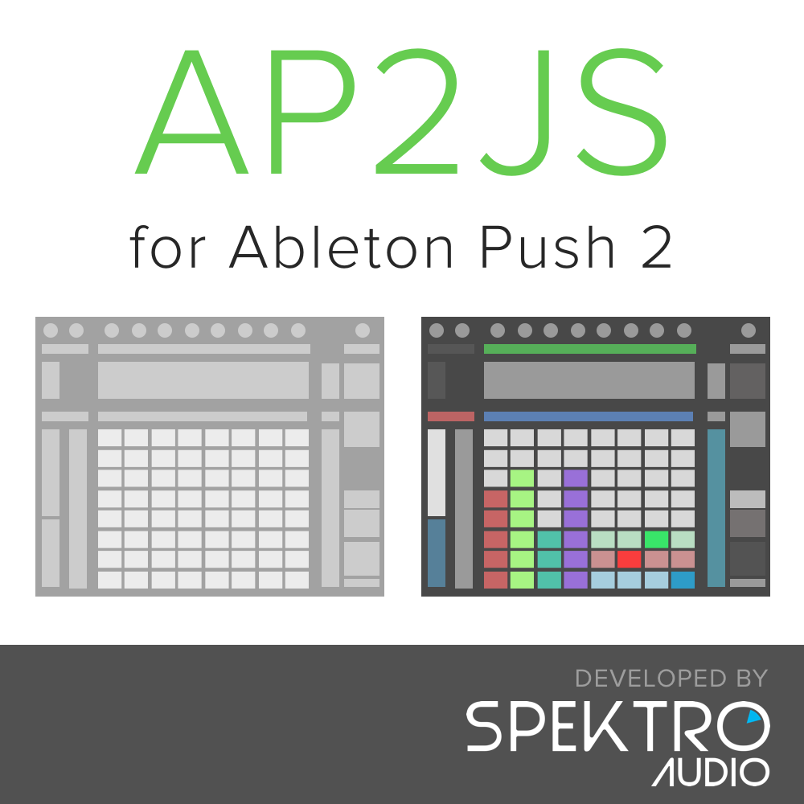

# AP2JS

AP2JS is a JavaScript script for Cycling 74' Max 7 / 8 designed to simplify the process of controling and programming the [Ableton Push 2](https://www.ableton.com/en/push/).  
The different methods available in AP2JS lets the user control the leds of the 8x8 pad grid, buttons, and touchstrip.  
AP2JS also re-routes MIDI commands coming from the Push 2 (pad /button presses + encoder direction) to it's second output to simplify the programming process.

Current version: 0.01 (BETA)

AP2JS was created by Ícaro Ferre ([@icaroferre](http://twitter.com/icaroferre)).

Developed by **Spektro Audio**  
[spektroaudio.com](http://spektroaudio.com)

# HOW TO INSTALL

- Download the latest verison of ap2js.
- Move folder to a secure location.
- Open Max's File Preferences and add the ap2js folder.

# HOW TO USE

## Basic Setup Snippet

- Create a new Max patch.
- Open the Snippet section of the side-bar and drag the ```[ap2js] Basic Setup``` snippet into your patch.
- Click on the ```initialize``` message.

## Manual Instructions:

- Add a ```js ap2js.js``` object to your Max patch
- Add a ```midiin``` and a ```midiout``` to your Max Patch. Set both to the Push 2 User port.
- Route the output of the ```midiin``` to the input of the ```js ap2js.js``` and route the output of the ```js ap2js.js``` to the input of the ```midiout``` object.
- Send a ```initialize``` message to the ```js ap2js.js``` object.

**ATTENTION: AP2JS is designed to only send messages when in User Mode therefore the Push must be set to User Mode via the initialize message / method.** 

# INCOMING MIDI MESSAGES

MIDI messages generated by the Push 2 are parsed by AP2JS and routed to the second output of the ```js``` object.

Because all messages are sent to a single output, AP2JS automatically prepends the message type so different types can be filtered via a ```route``` object.

These are the MIDI messages that are parsed by AP2JS:

- ```xy``` (8x8 Pad Grid): MIDI notes generated by the pads are re-formatted as ```X Y VALUE```.
- ```button``` (RGB / Mono buttons): CC messages generated by button presses are re-formatted as ```BUTTON_NAME VALUE```.
- ```encoders```: because encoders don't generate specific MIDI values, AP2JS outputs their messages as ```ENCODER_NAME inc bang``` or ```ENCODER_NAME dec bang``` (depending on the direction of the movement).

## COLORS

To make it easier for programmers to set different colors for each pad and button of the Push 2, AP2JS uses **"on"** and **"off"** colors.  
By default, "off" is set to 0 and "on" is set to 1. These colors can be overwitten using the different methods available below.  
The pads and buttons can also be set to other colors without overwritting the colors of the two states.


# AVAILABLE METHODS

## GLOBAL

```set_mode(mode)```: sets the Push 2 mode (modes available: live, user, both).

## PADS

Pads can be addressed via their X/Y position on the 8x8 grid (x and y valued range from 0 to 7).  

```set_pad_color(x, y, off, on)```: sets the off and on colors for the pad in the x/y position
```set_row_color(y, off, on)```: sets the off  and on colors for an entire row of pads
```set_column_color(x, off, on)```: sets the off  and on colors for an entire column of pads  
```set_allpads_color(off, on)```: sets the off  and on colors for all pads

```set_pad(x, y, value)```: set the pad in the x/y position to a color (if value is integer) or to a state (if value is "on" or "off")
```set_pad_blink(x, y, value)```: sets the blink mode (value = 1 or 0) of the pad in the x/y position

```set_row(y, value)```: set a row of pads to a color (if value is integer) or to a state (if value is "on" or "off")
```set_column(x, value)```:  set a column of pads to a color (if value is integer) or to a state (if value is "on" or "off")

```clear_row(y)```: set a row of pads to "off"
```clear_column(x)```:  set a row of pads to "off"
```clear_all()```: set all pads to "off"

```set_row_fill(y, fill, value)```: sets a row (```y```) as a horizontal fader by setting a number of pads (```fill```) to  ```value``` (remaining pads are set to "off").
```set_column_fill(x, fill, value)```: sets a column (```x```) as a vertical fader by setting a number of pads (```fill```) to  ```value``` (remaining pads are set to "off").

```set_row_exclusive(x, y)```: clears row ```y``` and sets x/y pad to "on"
```set_column_exclusive(x, y)```: clears column ```x``` and sets x/y pad to "on"
```set_xy_exclusive(x, y)```: clears all pads and sets x/y pad to "on"

## BUTTONS

Buttons can be addressed via their name in lowercase (e.g. ```play```, ```fixed_legth```, ```tap_tempo```, etc).  
The rectangular buttons above the display are named ```track_1``` through ```track_8``` and the ones below the display are name ```device_1``` through ```device_8```.

```get_button_type(name)```: outputs button type (rgb / mono) to the second output of the ```js``` object.

```set_button_color(name, off, on)```: sets the "off" and "on" colors of the button

```set_button(name, value)```: set button to a specific color (if value is integer) or to a state (if value is "on" or "off")
```set_button_blink(name, value)```: sets the blink mode (value = 1 or 0) of the button
```get_button_list()```: prints a list of all available buttons to the Max Window / Console.

## TOUCHSTRIP

```set_touchstrip_mode```: sets the touchstrip mode (available modes: ```default``` or ```centered``).

```set_touchstrip```: sets the touchstrip value (0 - 127).

# KNOWN ISSUES / LIMITATIONS

- Some of the pads methods "re-draw" all pads therefore it's not incredibly efficient and can crash the Push 2 if the period between messages is too short (< 50ms).

- AP2JS Beta may cause issues if used alongside Ableton Live.

